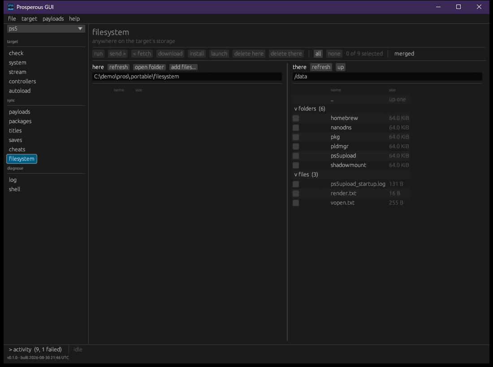

# Files

Everything on the target's storage moves over `ftpsrv` (port 2121): single files, whole
folders, titles, saves and packages. The commands here work anywhere on the target; the
sections in [library](library.md) and [titles](titles.md) are the same operations pointed at
the places those things live.

## Command line

| Command | Does |
|---|---|
| `pros ls [path]` | list a directory on the target (default `/data`) |
| `pros pull <path> [--into <file>]` | fetch one file; written under its own name unless `--into` is given |
| `pros push <file> <path>` | put one local file at a path on the target |
| `pros backup <folder> [--into <dir>]` | copy a folder off the target, recursively |
| `pros restore <dir> <folder>` | copy a local folder onto the target, recursively |

```bash
pros ls      /data/homebrew
pros pull    /data/report.txt --into ./report.txt
pros push    ./payload.elf /data/payload.elf
pros backup  /data/homebrew/GLCB00001 --into ./GLCB00001
pros restore ./build/title/GLCB00001 /data/homebrew/GLCB00001
```

Each file is printed as it goes, then a total.

### Incomplete copies

A folder copy that skipped anything lists every skipped file with the reason, says
`this copy is incomplete - do not treat it as a backup`, and exits 1. One unreadable file
does not end the walk. Links are not followed, and appear in the skipped list.

A restore puts files where it is told and does not merge or interpret them; `backup` and
`restore` move bytes and understand no save format.

### Unchanged files

A restore does not re-send a file it already put there unchanged. It records what it verified
landing on each target (`deployed.json`), and skips a file whose local bytes match that record
and which the target still lists. The output counts these as `already there, unchanged - not
re-sent`, so a rebuild that changed one file sends one file. A changed file, or one the target
has lost, is always sent. `--all` sends every file, for when the record cannot be trusted, such
as a target reinstalled behind the same name. (D034)

### Destinations the target ignores

A title restored under `/user/app` lands and is then never mounted, so it never appears on the
home screen. `pros restore` refuses that destination and suggests `/data/homebrew/<id>`, the
folder the target scans, under the title's own identifier:

| Flag | Does |
|---|---|
| (none, at a terminal) | shows the refusal and asks whether to use the suggested path |
| `-y`, `--yes` | uses the suggested path without asking |
| `--force` | copies to the requested path anyway |

`pros push` to `/user/app` warns and copies.

## Window



The **filesystem** section browses anywhere on the target. Like every sync section it has two
panes: **here** on the left is a folder on this machine, **there** on the right is a folder on
the target.

| Control | Does |
|---|---|
| path boxes | type a path and press Enter to go there |
| device list (there) | choose internal storage or a removable device, and a known place on it |
| **up** | go to the parent folder |
| **refresh** | list the side again |
| **open folder** (here) | show this machine's folder in the file browser |
| **add files...** (here) | copy files from anywhere on this machine into this folder |
| **merged** | one list with a column for each side, instead of two panes |
| **all** / **none** | tick everything listed, or nothing |

Actions apply to every ticked row, and a disabled one says why on hover:

| Action | Does |
|---|---|
| **send >** | copy the ticked items onto the target, into the folder the right pane shows |
| **< fetch** | copy the ticked items to this machine |
| **launch** | start an installed title by identifier ([titles](titles.md)) |
| **install** | install a package ([library](library.md)) |
| **delete here** / **delete there** | remove the ticked items from one side, after a confirmation; not undoable |

Sending a title to an ignored destination stops with the same refusal as the command line,
offering **Use '/data/homebrew/<id>' instead**, **copy anyway** or **leave it**. Sending
skips unchanged files as above.

A long copy shows its progress in the bottom bar; **stop** there finishes the file in flight,
then stops and reports what was left.
