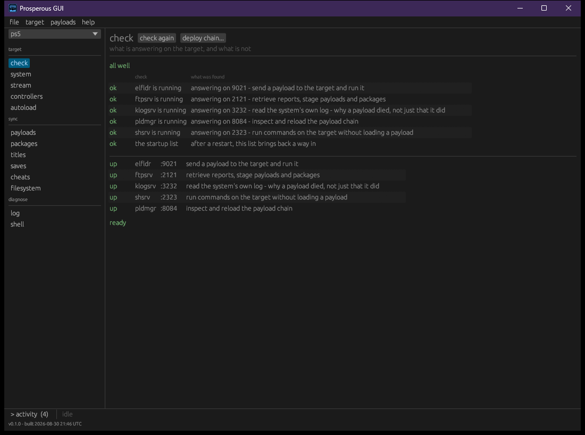

# Getting started

Prosperous talks to anything that runs Orbis software - a console prepared to run homebrew,
or orbistoun. This page takes you from a download to a target that answers.

You do not need to have read anything else first, and you do not need to know what any of
the five services are. The tool asks; you read the answer.

## 1. Get it

Download the build for your machine from the
[releases page](https://github.com/project-oops/Prosperous/releases) and unpack it. There
are two programs in the archive, and they do nearly the same things:

| | |
|---|---|
| `pros` | the command line |
| `pros-gui` | the window |

The one difference: installing a package is in the window and not on the command line. Nothing
else is split between them.

Nothing is installed and nothing is written outside the collection's own directory, so
"uninstalling" is deleting the folder.

## 2. Tell it where the target is

A target is a name and an address. That is the whole registration - everything else about a
machine can change between one power cycle and the next, so nothing else is stored.

```bash
pros register 192.168.1.211 --name living-room
```

Pick any name you like; it is what you will type from now on. In the window, the same thing
is **target → register**.

If you get the address wrong, register the same name again with the right one. It replaces
the address and keeps any port overrides, so correcting a typo never costs you anything
else.

## 3. Ask what it can do

```bash
pros check --name living-room
```

This is the command to run whenever something is not working, and usually the only one you
need to diagnose it.



Each row is a service, and each says **what it buys you** rather than only whether a port is
open:

| | |
|---|---|
| `elfldr` | send a payload to the target and run it |
| `ftpsrv` | retrieve reports, stage payloads and packages |
| `klogsrv` | read the system's own log - *why* a payload died, not just that it did |
| `shsrv` | run commands without loading a payload |
| `pldmgr` | inspect and reload the payload chain |

### Reading the result

**All five up.** You are ready. Nothing else needs configuring.

**Only the loader is down.** The jailbreak has not been run, or was lost to a restart. That
is normal after a power cycle and the remedy is to run it again - which is why the loader is
checked first: its failure has a different fix from every other failure here.

**Everything is down.** The target is off, asleep, on another network, or has not been
jailbroken since its last restart. Prosperous cannot tell those apart from outside and does
not guess.

**A slow answer is reported, not hidden.** A timing in the result - `(1510ms)` - means the
service did not refuse, it never replied. Refused and timed-out look identical if all you
print is "down", and they mean different things: refused is a service that is not running,
a timeout is usually a firewall or a sleeping machine.

**Nothing is registered.** `pros list` prints nothing and exits cleanly. That is where
everyone starts, not an error.

## 4. What next

- **[The target's storage](../features/library.md)** - titles, saves and packages, both
  directions. This is what makes a save from real hardware into something orbistoun can mount.
- **[Payloads](../features/payloads.md)** - sending one, watching it, and reading the log
  when it dies.
- **[Targets](../features/targets.md)** - port overrides, and what a registration does and
  does not remember.
- **[Building it](../BUILDING.md)** - only if you would rather build than download.

If you want the detail behind a check rather than the summary:

```bash
OOPS_LOG=pros_link=trace pros check --name living-room
```

Every tool in the collection takes `OOPS_LOG` and reads it the same way.
