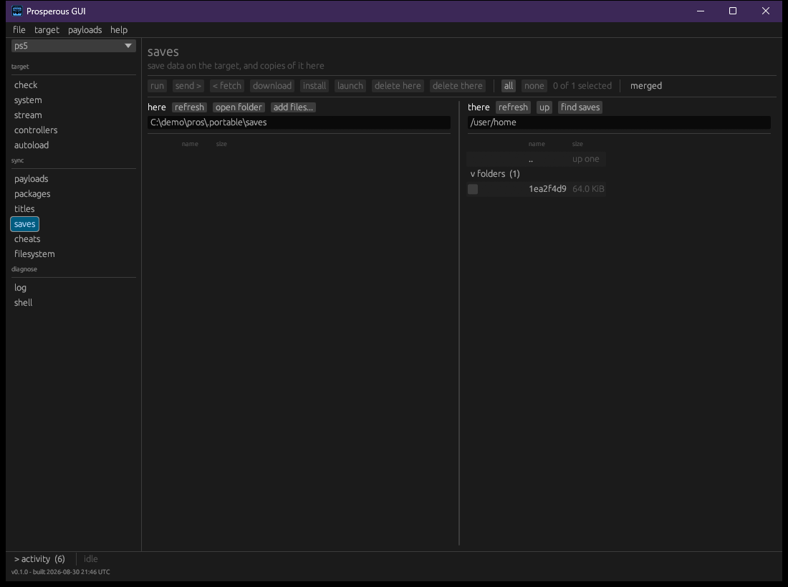

# Library

What is on the target's storage: titles, saves, packages and cheats. Everything here moves over
the file service, `ftpsrv`. Copying files and folders in general is in [files](files.md);
installed titles, launching and closing them are in [titles](titles.md).

## Browsing

```bash
pros library                    # /user/app
pros library /data/homebrew
pros library /user/app --titles # only what looks like a title
```

Each entry is shown as `title`, `pkg`, `dir` or `file`, with its size and, for a title, its
identifier. The last line is the total; when some entries stated no size, it says how many the
total covers.

## Saves

```bash
pros saves
```

Saves live under a per-account folder, `/user/home/<user>/savedata_prospero`. `pros saves`
finds that folder and lists each save by the name of the title it belongs to; a save whose
title is no longer installed shows its identifier and says nothing names it. With several
accounts it lists each account's folder and does not choose between them.

A save is a folder, copied with `pros backup` and `pros restore` ([files](files.md)):

```bash
pros backup  /user/home/<user>/savedata_prospero/GLCB00001 --into ./saves/GLCB00001
pros restore ./saves/GLCB00001 /user/home/<user>/savedata_prospero/GLCB00001
```



The **saves** section starts at `/user/home`; **find saves** goes to the account's save
folder. A save is signed for the account that wrote it, so the window checks whose save it is
before sending one into an account folder. A save written by another account, or one whose
owner cannot be checked, is not copied; the panel says why and offers **copy anyway** or
**leave it**.

## Packages

The **packages** section shows this machine's `packages/` folder beside the places packages are
kept on the target, chosen from the device list:

| Place | Path |
|---|---|
| uploads | `/data/homebrew/pkg` |
| install staging | `/data/pkg` |

Both folders are made by upload tools on the target, so a target may have either, both or
neither.

### Installing a package

**install** is in the window only; `pros` has no command for it. Tick the packages on this
machine and press **install**. A confirmation lists them; after **install** each one is held
out from this machine for the target to fetch over HTTP, and the target registers what it finds.
After that it is an installed title, not a file, and nothing here undoes it. The target's own
screen shows whether the installer finishes.

The target connects back to this machine, so this machine's address must be reachable from the
target. When it is not (a virtual machine behind address translation, for example), the result
says `the target never fetched the package`.

## Cheats

The **cheats** section shows cheat files on both sides. There is no single standard folder:
the cheat runner reads its own and two others, so the window asks the target which of these
exist and offers them in the device list:

| Place | Path |
|---|---|
| cheatrunner's own | `/data/cheatrunner/cheats` |
| etaHEN's | `/data/etaHEN/cheats` |
| elf-arsenal's | `/data/elf-arsenal/cheats` |

## Tracked lists

The payloads, packages, titles, saves and cheats sections each read a list of known items
alongside the two folders, so something described and on neither side shows as
`not here yet`, ready for **download**. The titles list describes open-source engines only, and
the saves list is empty, since a save is signed for the target that wrote it.
