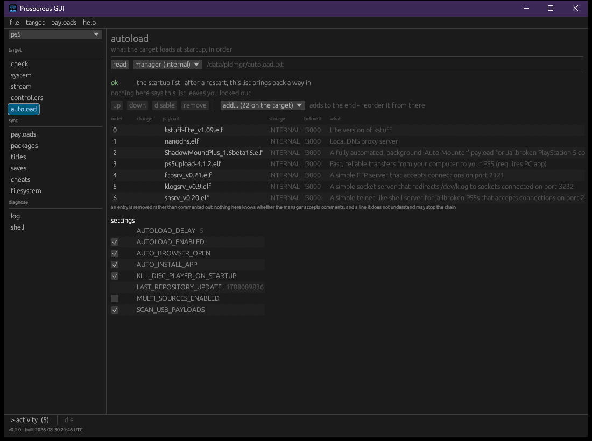

# Payloads

A payload is an ELF sent to the target's loader, `elfldr` (port 9021), which runs it from
memory until the next power cycle. Prosperous describes payloads, verifies them and delivers
them; it ships none.

## The manifest

What Prosperous carries is a manifest: each payload's name, version, where it is published,
its SHA-256 digest and what it is for. It follows the payload manager's own schema, so a
target that already has a configured manager can be read as the source.

Three manifests can be in play:

| Manifest | Where |
|---|---|
| the built-in list | inside the program, used when you have none of your own |
| yours | `payloads.json` in the data directory ([getting started](getting-started.md)) |
| the target's | `/data/pldmgr/repository_cache.json`, read with `--from-target` |

```bash
pros payloads                     # what your list (or the built-in one) describes
pros payloads --from-target       # what the target's own repository describes
pros payloads --from-target --check
pros payloads --write             # write the built-in list out as payloads.json, to edit
pros payloads --from-target --save  # merge what was read into payloads.json
```

`--write` never overwrites an existing `payloads.json`. `--check` also probes the target:

```
off  2 here   elfldr           0.30       send it a payload, it runs it
?    -      ! SomePayload      -          mounts things

columns: running / boot-list position / staged here / verifiable
```

| Column | Values |
|---|---|
| running | `on`, `off`, or `?` when no port this project knows identifies it; `?` is not `off` |
| boot-list position | its place in `/data/pldmgr/autoload.txt`, `-` when absent, `?` when the list could not be read |
| staged here | `here` when a verified copy is in the data directory's `payloads/` |
| verifiable | `!` when the entry cannot be checked; those are listed with the reason at the end |

A service can be answering now and be absent from the boot list. It is then gone after the
next restart.

## Fetching and staging

Nothing unverified is kept or sent.

```bash
pros fetch elfldr --from-target      # download one, using the target's urls and digests
pros fetch --all                     # everything described that is not here yet
pros stage ./elfldr.elf --as elfldr  # keep a file you already have, checked on the way in
pros verify ./elfldr.elf --against elfldr --manifest ./payloads.json
```

- A payload with no usable checksum is refused before anything is downloaded.
- A download that fails its digest is discarded; the message names the expected and found
  digests, and `fetch` exits 1.
- `stage` checks the file against its manifest entry before copying it into `payloads/`.
- `verify` checks a file without keeping it.

Downloads run `curl -fL --silent --show-error --output {into} {url}`. To use another program,
put one line in `fetch.txt` in the data directory, with `{url}` and `{into}` where the address
and destination go.

## Sending

```bash
pros send ./payload.elf              # send it and listen 10 seconds for what it prints
pros send ./payload.elf --seconds 30
```

`send` checks the file's shape first and refuses one the loader would accept and then fail to
run, such as a signed module, naming what the file is. Silence on the socket is not failure:
only a payload launched this way reports there, and one that writes a file can be read back
with `pros pull` ([files](files.md)).

`pros check --fix` sends every missing service that is staged here ([targets](targets.md)).

## Supervising

```bash
pros supervise ./probe.elf --port 9803
```

Keeps a probe alive on the target while something else drives it. It watches the probe's port
about once a second and, when it stops answering, sends the same file again. Every change is
printed.

| Flag | Default | Meaning |
|---|---|---|
| `--port` | 9803 | the port the probe listens on once up |
| `--patience` | 3 | dead starts in a row before giving up (exit 1) |
| `--restarts` | 0 | stop after this many restarts; 0 keeps going |

## Window: payloads

The **payloads** section pairs a table of described payloads on the left with the target's
payload folder, `/data/pldmgr/payloads`, on the right. The table shows each payload's version,
size, whether it is running, its boot-list position and whether it is on the target.

| Control | Does |
|---|---|
| **run** | send a copy on this machine to the loader, or start one that is only on the target through the shell |
| **send >** | write the payload onto the target's disk, in its own folder with a `.json` beside it, the layout the manager reads |
| **download** | fetch it from where the list says it is published, verified, into this machine's `payloads/`; **update** when an older version is already here |
| **< fetch**, **delete here**, **delete there** | as in [files](files.md) |
| **run from file...** | choose any ELF and run it |
| **check sources** | ask each payload's project for its latest release, so the version column shows whether the list is current |
| **open folder**, **re-read** | show or re-list this machine's `payloads/` folder |

**run** loads a payload into memory now; **send >** puts a file on a disk.

A file dropped on the window whose name matches a described payload is verified and staged.
One that matches nothing, such as a local build, is offered with **run it now** or
**keep in payloads**; its shape is still checked before it is sent.

## Window: autoload



The **autoload** section shows what the target loads at startup, in order, from
`/data/pldmgr/autoload.txt`, and the payload manager's settings. The list chooser also offers
startup lists on removable storage, read only. **read** reads them again.

An edit is never written directly. It is marked in the list as `not written yet`, with the
whole file as it will be written under **the file as it will be written**, and the result is
audited before it goes. **write it** sends the file; when the audit finds something grave the
button reads **write it anyway**, beside **fix these N first**. A wrong startup list can leave the
target without its loader or file service, and recovery is running the entry point by hand
again.

**export chain...** writes the current list down as a chain preset of your own, to deploy to
another target or to this one after something breaks it ([targets](targets.md)).
