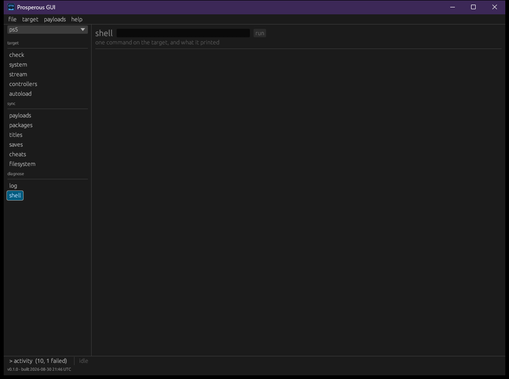

# Shell

The shell service, `shsrv` (port 2323), runs one command on the target without loading a
payload. It is for looking: listing, checking free space, reading what is running.

## Command line

```bash
pros sh --name living-room "ls /data/homebrew"
pros sh "df -h"
```

The command is one argument, so quote it. What the target printed is printed here. An empty
reply says `no output - is the shell loaded?` and points at `pros check`, because a shell that
is not running and a command that printed nothing otherwise look the same. The window says the
same thing.

## Window



The **shell** section has a command line and **run**; the reply fills the area below.

## Replies and quiet

The shell sends no marker at the end of a reply, so a reply is taken as complete after 1.2
seconds with nothing new, in the command line and the window alike. A command whose output
pauses longer than that mid-way is cut short. This is a property of the service, and the
reason the shell is for looking rather than for scripting.

The shell splits a line on spaces and offers no quoting. Launching a title, ending a process
and listing processes each have their own command ([titles](titles.md)) that builds the line
the target accepts and reads its reply.
