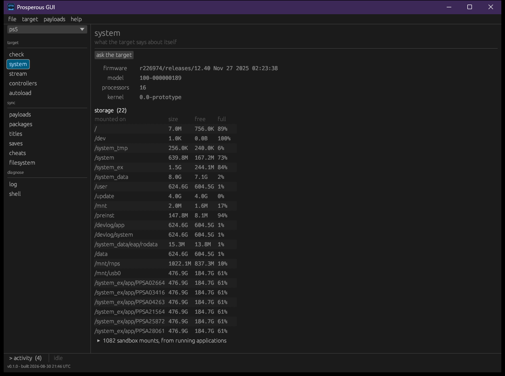

# Targets

A target is a machine Prosperous knows how to reach: a name, an address, and any ports that
differ from the defaults. Every other command takes one as its subject. Registering and
reading a check are introduced in [getting started](getting-started.md).

## Registrations

| Command | Window | Does |
|---|---|---|
| `pros register <address> --name <name>` | **target > register...** | remember an address under a name (the name defaults to `prospero`) |
| `pros register <new-address> --name <name>` | **target > edit this target...** | change a target's address; its name, ports and chain are kept |
| `pros list` | the target list in the sidebar | show what is registered |
| `pros forget <name>` | **target > forget this target** | remove a registration |
| | **target > reload registrations** | re-read `targets.txt` after editing it by hand |

`--name` picks the target for any command. With exactly one registered it can be left out;
with several, a command without it lists them and stops.

## The registry file

`targets.txt` in the data directory ([getting started](getting-started.md)) holds one target
per line and is meant to be edited by hand:

```
# name       address         overrides
living-room  192.168.1.211
lab          192.168.1.40    ftpsrv=2122 chain=mine
```

- `service=port` replaces that service's port for this target, for checks and transfers
  alike. A word not in `service=port` form is ignored rather than guessed at.
- `chain=<name>` names the startup chain the target is meant to run, so the check screen does
  not report as missing what that chain provides.
- A line starting with `#` is a comment.

## The check

`pros check` asks every service and prints what each one unlocks, then a verdict. The table
and verdicts are explained in [getting started](getting-started.md).

```bash
pros check --fix
```

`--fix` sends each missing service that the manifest describes and that is already staged
here, then checks again. It downloads nothing and leaves the boot list alone; a service not
staged here is named with the command that would fetch it ([payloads](payloads.md)).

In the window, the **check** section shows the same table under **check again**. Above it is
the startup audit: each finding about the payload chain, worst first, with the action that
answers it. **fix...** and **fix all** draw the whole plan step by step, including steps
already done; nothing happens until **do these N** is pressed, and **not now** drops it. A plan
that changes the startup list prepares the edit on the **autoload** screen, where the whole
file is shown before it is written ([payloads](payloads.md)).

**deploy chain...** sets a target up from nothing: choose a chain and where it goes, read what
the target would end up with, then agree to it.

## The system report



The **system** section asks the target what it is: its facts, its storage (with the sandbox
mounts of running applications folded away), and what is running. **ask the target** reads it
again. The process list and its controls are described in [titles](titles.md).
