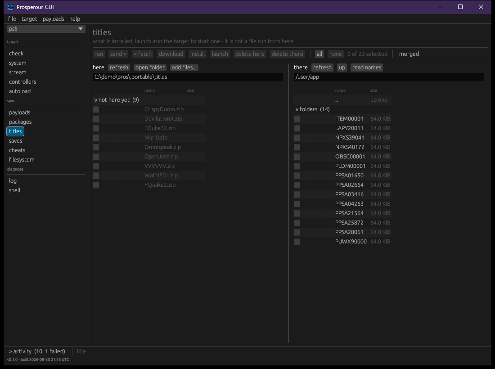

# Titles

A title is an application installed on the target, known by its identifier: nine characters,
four letters then five digits, such as `GLCB00001`. Launching one asks the target's own system
service to start it, the way the home screen does; no file crosses the link. Running an ELF
from this machine is a different thing, described in [payloads](payloads.md).

Launching, process control and the probe loop go through the shell service, `shsrv`.

## Installed titles

```bash
pros titles --name living-room
```

Lists each installed title by identifier, version and name, read from `/user/appmeta`. A title
whose description cannot be read shows its identifier, `?` and the reason.



The **titles** section shows this machine's `titles/` folder on the left and `/user/app` on
the target on the right, with the actions described in [files](files.md). **read names** asks
the target what each listed title is called, and **launch** starts the ticked ones.

## Launching and closing

| Command | Does |
|---|---|
| `pros launch <id>` | ask the target to start an installed title |
| `pros close <id>` | end every process the title owns |
| `pros restart-ui` | restart the user interface to clear a softlock, without a reboot |

`pros launch` refuses anything that is not an identifier, since the target would pass stray
words to the title as arguments. It then reads the target's reply: exit 0 means the target
accepted the request, which is not the same as the title having started; exit 1 means the
target refused it, and the reason is printed.

`pros close` wakes a stopped process before ending it, so its exit teardown runs and leaves no
locked files. Afterwards it lists the processes again and says whether the title is gone or
still listed, exiting 1 if it is still there.

`pros restart-ui` ends `SceShellUI` by name and nothing else. `SceSysCore` starts it again, so
the screen comes back on its own.

A finished big-app parks rather than exits, and a parked big-app ignores every signal. `close`
cannot end one; the target's own dashboard close does. While one is parked it holds the
application slot, and the next launch is refused.

## Processes

| Command | Does |
|---|---|
| `pros ps` | list the running processes |
| `pros top [--every <s>] [--seconds <s>]` | the same list, redrawn every 2 seconds (or `--every`) until Ctrl-C or the `--seconds` cap |
| `pros kill <pid>` | end one process by pid |

The columns are `PID`, `STATE`, `MEM`, `TITLE` and `COMMAND`. `MEM` is the figure the target's
own `ps` prints, in MiB in use; a process with no figure shows `-`. There is no CPU column
because the target reports none.

`top` is read-only. On a terminal it clears between draws; piped to a file it prints one table
after another. A read that fails is reported and the watch continues.

`kill` is for what `close` cannot name: a payload, a stuck process, anything without a title.
It sends the signal in the form the target's `kill` builtin accepts, wakes a stopped process
first, and says afterwards whether the pid is gone.

In the window, the **system** section ([targets](targets.md)) lists the running processes,
titles first:

| Control | Does |
|---|---|
| **close** on a title | the same as `pros close` |
| **everything else** | the other processes, folded |
| **end** on a process | the same as `pros kill` |
| **restart UI** | the same as `pros restart-ui` |
| **sort** | as listed, by memory, or by state, within each group |
| **auto-refresh** | re-read the target every 3 seconds while the section is open; off by default |

Each row shows the memory in use, with the peak on hover. After any action the list is read
again, so it shows what is running now.

## The probe loop

Deploying a homebrew build, running it and reading what it prints is one command:

```bash
pros probe GLCB00001 ./build/title/GLCB00001
pros probe GLCB00001 ./build/title/GLCB00001 --seconds 90   # follow for at most 90 s (default 120)
pros probe GLCB00001 ./build/title/GLCB00001 --all          # send every file, not just changed ones
```

In order, it:

1. closes the title if it is running (best effort, as above)
2. restores the build folder into `/data/homebrew/<id>`, skipping unchanged files as a restore
   does ([files](files.md)); a restore that does not land cleanly stops here
3. waits up to a minute for the target to register the title, since the files are on disk
   before the target has mounted them
4. attaches to the log, then launches, so nothing the title prints at start is lost
5. prints each log line until the title parks (prints its park line), exits, or the
   `--seconds` cap passes

A launch that is refused stops the loop and names the likely cause: a parked title holding the
slot.

The window's **probe** section runs the same loop for a title already installed, without the
restore: choose a title, set how long to follow (**for**), and press **launch and capture**.
**stop** stops following and leaves the title running. The capture has the log section's
filter, **copy** and **save** ([logs](logs.md)); **refresh** re-reads the installed titles.
